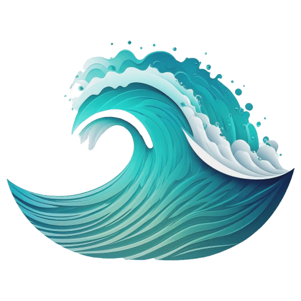
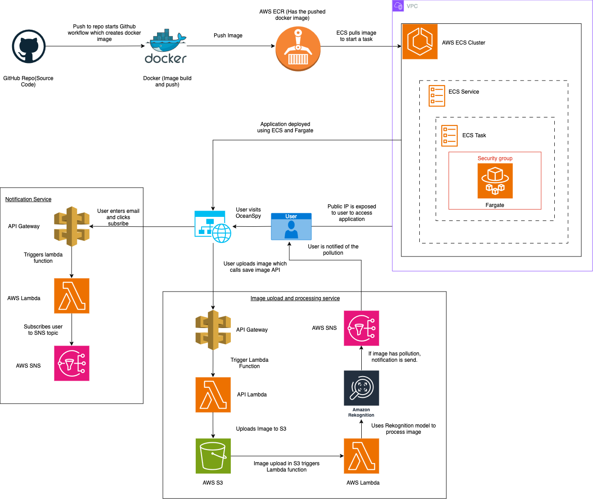

# OceanSpy

<p align="center">
  
</p>

- [Visit the Application 🌐](http://54.162.175.97:3000/)
- [Project PDF 📄](media/Project.pdf)

## Overview

The OceanSpy is a web application designed to detect and analyze pollution in the ocean using real-time image uploads and live camera detection. The application leverages AWS services to handle image uploads and analysis, providing users with insights into ocean pollution.

## Features

- **Upload Image**: Users can upload images of the ocean to detect pollution.
- **Live Detection**: Real-time detection using the webcam to periodically capture images and analyze them for pollution.
- **Responsive Design**: Mobile-friendly and designed for various screen sizes.

## Technologies Used


- **Frontend**: React, Vite
- **Containerization**: Docker
- **Backend**: AWS Lambda, API Gateway
- **Image Processing**: AWS Rekognition
- **Storage**: AWS S3
- **Notifications**: AWS SNS
- **CI/CD**: GitHub Actions, AWS ECS, AWS ECR
- **Web Technologies**: HTML, CSS

## Architecture



## How It Works

### Image Upload and Processing Pipeline

1. **Image Upload**:
   - Users upload an image through the web interface.
   - The client-side React application sends an API request to AWS API Gateway.
   - The request triggers an AWS Lambda function that decodes and uploads the image to an S3 bucket.

2. **Image Processing**:
   - Upload to S3 triggers another AWS Lambda function.
   - This Lambda function processes the image using AWS Rekognition.
   - If the image is detected with pollution (confidence >= 80), a notification is sent via AWS SNS.

### Notification Subscription Pipeline

1. **User Subscription**:
   - Users subscribe to notifications by entering their email ID on the website.
   - The client application sends an API request via AWS API Gateway to an AWS Lambda function.
   - The Lambda function subscribes the user’s email to an AWS SNS topic.

### CI/CD Pipeline

1. **Code Commit**:
   - Every push to the GitHub repository triggers a GitHub Actions workflow.
   - The workflow builds a Docker image and pushes it to AWS ECR.
   - A new deployment is initiated in AWS ECS, which uses Fargate for instance management.

## Installation

1. **Clone the Repository**:

   ```bash
   git clone https://github.com/your-username/Ocean-Pollution-Detector.git
   cd Ocean-Pollution-Detector

## Testing

1. Go to the application. On the home page, you will see "Upload Image" and "Subscribe" buttons.
2. Click on the "Subscribe" button, enter your email ID, and save.
3. You will receive a confirmation email from AWS. Confirm your subscription.
4. Click on "Upload Image" to submit an image.
5. If pollution is detected in the image, you will receive a notification email; otherwise, no email will be sent.

## License

This project is licensed under the MIT License - see the LICENSE file for details.

## Contact

Created by: Priya Mandyal
